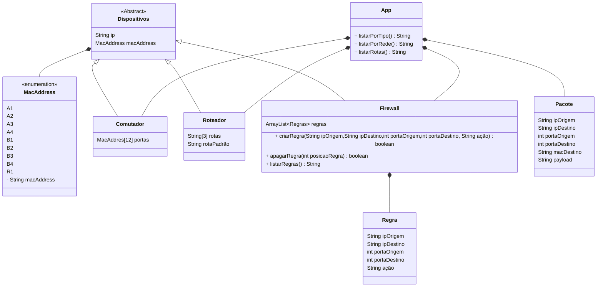

```mermaid
classDiagram
    
    class MacAddress{
        <<enumeration>>
        A1
        A2
        A3
        A4
        B1
        B2
        B3
        B4
        R1
        
        - String macAddress
    }
        
    
    class Dispositivos{
        <<Abstract>>
        String ip
        MacAddress macAddress
    }
    
    class Comutador{
        MacAddres[12] portas
    }
    
    class Roteador{
        String[3] rotas
        String rotaPadrão
    }
    
    class Regra{
        String ipOrigem
        String ipDestino
        int portaOrigem
        int portaDestino
        String ação
    }
    
    class Firewall{
        ArrayList~Regras~ regras

        + criarRegra(String ipOrigem,String ipDestino,int portaOrigem,int portaDestino, String ação) boolean
        + apagarRegra(int posicaoRegra) boolean
        + listarRegras() String
    }
    
    class Pacote{
        String ipOrigem
        String ipDestino
        int portaOrigem
        int portaDestino
        String macDestino
        String payload
    }
    
    class App{
        + listarPorTipo() String
        + listarPorRede() String
        + listarRotas() String
    }
        
Dispositivos <|-- Comutador
Dispositivos <|-- Roteador
Dispositivos <|-- Firewall
Firewall *-- Regra
Dispositivos *-- MacAddress
App *-- Comutador
App *-- Firewall
App *-- Roteador
App *-- Pacote
```

