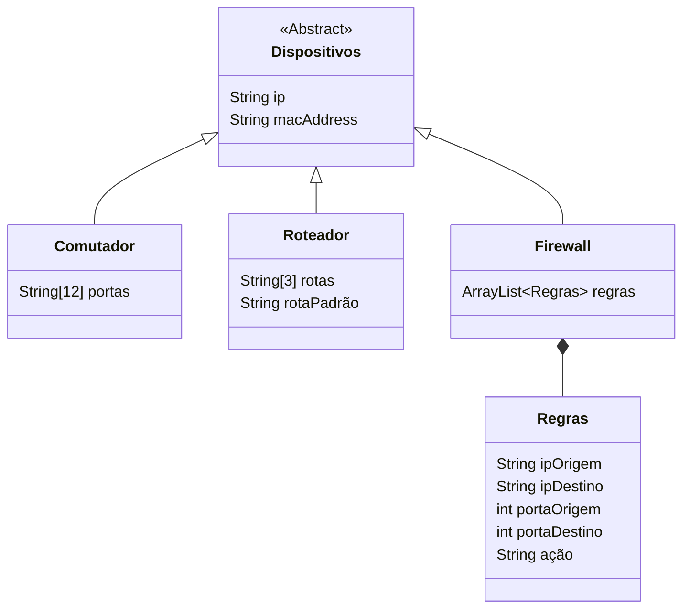

```mermaid
classDiagram
    
    class Dispositivos{
        <<Abstract>>
        String ip
        String macAddress
    }
    
    class Comutador{
        String[12] portas
    }
    
    class Roteador{
        String[3] rotas
        String rotaPadrão
    }
    
    class Regras{
        String ipOrigem
        String ipDestino
        int portaOrigem
        int portaDestino
        String ação
    }
    
    class Firewall{
        ArrayList~Regras~ regras
    }
        
Dispositivos <|-- Comutador
Dispositivos <|-- Roteador
Dispositivos <|-- Firewall
Firewall *-- Regras 
```

