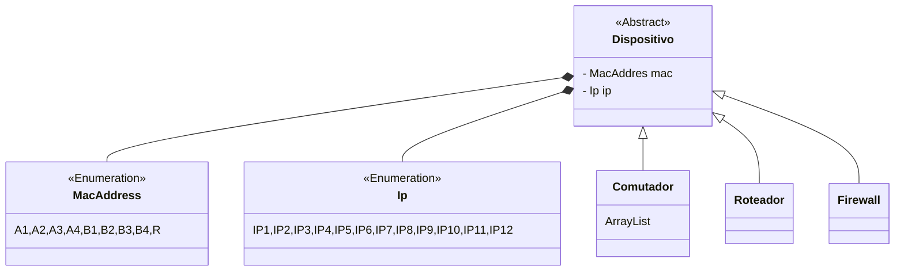

```mermaid
classDiagram
    
    class MacAddress{
        <<Enumeration>>
        A1,A2,A3,A4,B1,B2,B3,B4,R
    }
    
    class Ip{
        <<Enumeration>>
        IP1,IP2,IP3,IP4,IP5,IP6,IP7,IP8,IP9,IP10,IP11,IP12
    }
    
    class Dispositivo{
        <<Abstract>>
        - MacAddres mac
        - Ip ip
    }        
    
   class Comutador{
        ArrayList
   }
   
   class Roteador{
       
   }
   
   class Firewall{
       
   }
   
   Dispositivo *-- MacAddress
   Dispositivo *-- Ip
   
   Dispositivo <|-- Comutador
   Dispositivo <|-- Roteador
   Dispositivo <|-- Firewall
        

```

