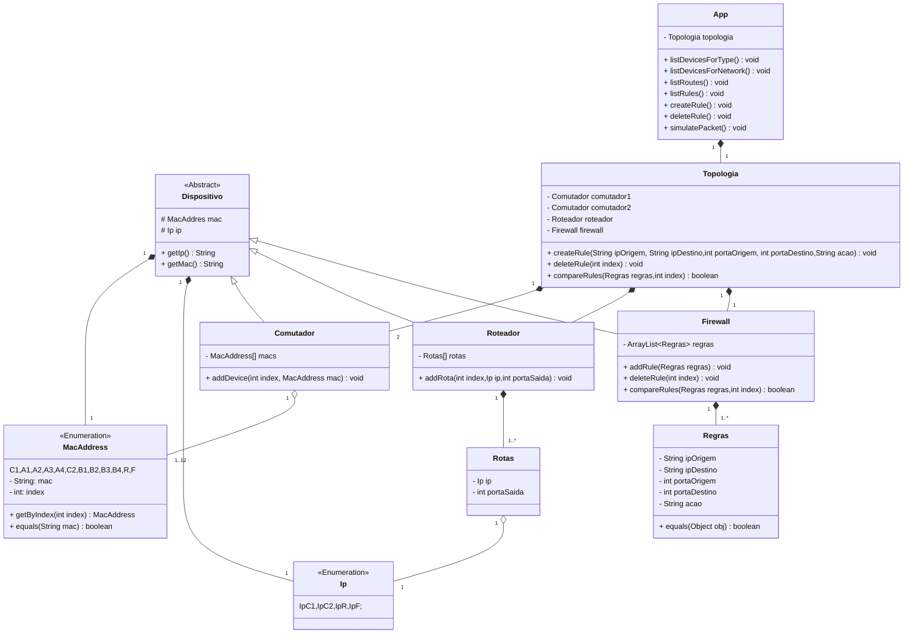

# Projeto 2 POO JAVA - Simulador de redes

## Objetivo do projeto
Neste projeto, nosso objetivo foi o de criar uma toplogia de rede estática definada nos requisitos do projeto e que fosse possível realizar as seguintes funcionalidades:

- Listar dispositivos por tipo
- Listar dispositivos por rede
- Listar rotas
- Listar regras de filtragem
- Criar regra de filtragem
- Apagar regra de filtragem
- Simular processamento de pacote

## Instruções do programa

### Como criar uma nova regra de filtragem
Para criar uma nova regra de filtragem, durante a execução do programa, selecione a opção 5 e digite o IP de origem, o IP de destino, a porta de origem, a porta de destino e a ação a se realizar caso a regra seja satisfeita.

### Criação de um pacote IP e simulação de processamento
A criação de um pacote IP ocorre durante a simulação de um pacote, selecionando a opção 7 durante a execução do programa. No meu ver a criação de uma classe "Pacote" neste caso não seria necessária, tendo em vista que este pacote seria utilizado apenas durante a execução da simulação de processamento do pacote. Após passar as informações do pacote, irá ser simulado o processamento do pacote em cada um dos dispositivos da topologia (Comutadores,roteador e firewall).

## Funcionalidade implementadas
Em minha aplicação, foi possível realizar a implementação de todas as funcionalidades solicitadas pelo projeto, funcionalidades essas informadas no [Objetivo do projeto](#objetivo-do-projeto)

## Diagrama de classes UML
Abaixo segue o diagrama de classes UML, indicando os principais atributos e os principais métodos de cada classe do programa

