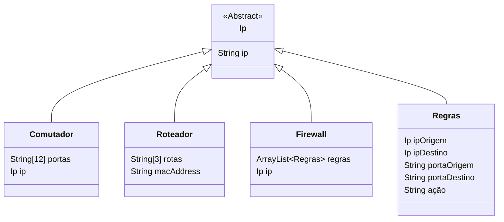

```mermaid
classDiagram
    
    class Ip{
        <<Abstract>>
        String ip
    }
    
    class Comutador{
        String[12] portas
        Ip ip
    }
    
    class Roteador{
        String[3] rotas
        String macAddress
    }
    
    class Regras{
        Ip ipOrigem
        Ip ipDestino
        String portaOrigem
        String portaDestino
        String ação
    }
    
    class Firewall{
        ArrayList~Regras~ regras
        Ip ip
    }
        
Ip <|-- Comutador
Ip <|-- Roteador
Ip <|-- Firewall
Ip <|-- Regras
```

